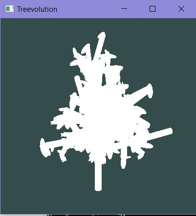
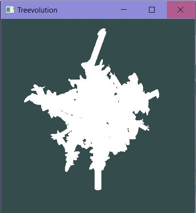

# Treevolution: Procedurally Generating Trees with Genetic Algorithms
Targeted procedural modeling can expedite the amount of time it takes for a technical director or artist to create content for specialized needs. Our tool allows users to provide a target silhouette or 3D model and receive a tree which closely matches that target. The tool does allow for tuning of L-System parameters and fitness evaluation methods that are used in the tree generation, so users with minimal technical background on L-Systems and genetic algorithms are target users. The tool outputs a polygonal mesh that closely matches the specified input target constraints, whether that be a simple silhouette or a 3D model. The tool is coded in C++ and incorporated into Maya with a plugin.

## Development Need

L-systems and other rule-based procedural models are used frequently in the graphics industry to populate large amounts of space with vegetation, trees, and other elements. These elements are easy to generate and can produce a wide variety, but tend to be very difficult to guide for specific desired outputs. For example, imagine a scene in a game or animated film with a vast topiary garden. Creating a rule set for a procedural model that creates trees and bushes with shapes would be extremely difficult if not impossible to accomplish. Targeted or controlled procedural modeling aims to solve this problem by finding the parameters to a rule-based grammar which will produce a specific target and delivering a model from said grammar.
This has the potential to drastically speed the process of modeling virtual worlds with very particular aesthetics. Unfortunately, past attempts at solving this problem have been either unsuccessful or slow to create a successful model because they rely on optimization of complex and multi-dimensional problems. Genetic algorithms may provide the solution to successful targeted procedural modeling as they can efficiently and effectively identify grammars which produce the desired output.

## Our Approach

The first paper to outline a procedure for incorporating genetic algorithms to perform targeted procedural modeling is “ShapeGenetics: Using Genetic Algorithms for Procedural Modeling” (Haubenwallner et al.). The paper provides explanations of how to accomplish mutation and crossover between two grammars as well as how procedural modeling can be applied to the general process of genetic algorithms. Fitness functions are explained in the paper and several options for fitness evaluation are outlined, including comparing silhouettes or cast shadows or volumes occupied between the target and the current model. The paper is also very convincing in its claim that it is the best method for targeted procedural modeling. Studies are included in the paper which compare their method with several other probabilistic models. According to the paper, the genetic algorithm approach outperforms other methods both in speed and in success of mimicking the target. We have implemented this paper as a Maya plugin.

### Genetic Algorithm

We perform a standard genetic algorithm. First a population of some input size of trees is created. Then for some input number of generations, we do the following:
- Evaluate the fitness of each tree and sort them by their fitness scores
- Set aside the best k trees to be added to the next generation, where k is the elitism value (which we set to 1/5 the population size)
- For the rest of the trees, one pair at a time, either mutate or crossover the trees and add the result to the next generation
  - Mutation: Some gene is either added, removed, or altered
  - Crossover/Reproduction: The makeup of the trees is mixed by choosing a random gene where we stop copying the first tree and start copying the second into the new tree

### Custom Data Structure

To allow for easy execution of all the elements of the genetic algorithm, we created a custom data structure to hold data about each tree. When generating trees initially, we use a stochastic L-System (so branching should occur randomly) and we randomize the parameters like the length and angle of each branch. We store all this information in TreeNodes. The TreeNode holds a character defining what kind of node it is (either a rotation or a lengthening command), the value of the parameter relevant to this command (the angle of rotation or length), and a list of child nodes which are commands that happen later on this branch. Thus, we can hold an entire tree structure with just one root TreeNode and traverse the structure easily to create such a tree.

### Fitness Evaluation

For fitness evaluation, our algorithm will have to voxelize meshes in order to easily compare them to the reference/target mesh. The steps are generally as follows:
- Create a 3D axis-aligned box surrounding the current mesh.
- For each voxel, check whether it lies inside the mesh
  - Cast a ray from the voxel center in any direction.
  - Count the number of intersections with the mesh
  - If the number is even, the voxel is outside. Else, inside.
- Compare each voxel to the corresponding target voxel structure. For each differing voxel, contribute a negative score. For each matching, a positive score.

For image/silhouette fitness evaluation, we simply:
- Render the scene from a certain perspective as an alpha map (1 or 0)
- Compare each pixel of that image to those in the target image/silhouette.
  - Each matching pixel contributes a positive score. All that are not matching, a negative score.

## Results

  

  

# Resources
[Learn OpenGL](https://learnopengl.com/)  
[GLFW](https://www.glfw.org)  
[GLM](https://glm.g-truc.net/0.9.9/index.html)  
[GLAD](https://glad.dav1d.de/)  
[STB](https://github.com/nothings/stb)  
